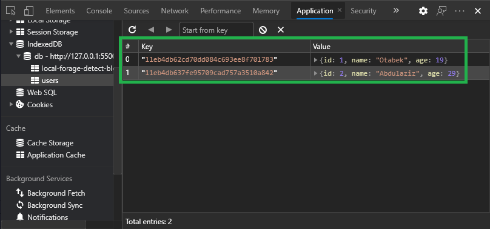
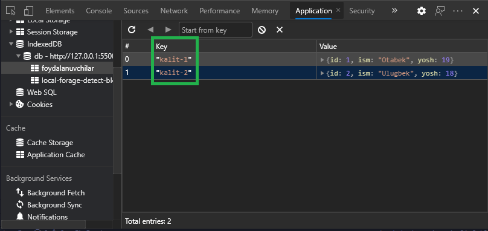

# MahalliyBaza <!-- omit in toc -->

Firebasega uslubidagi, offalyn, mahalliy ma'lumotlar bazasi.

MahalliyBaza sizga Firebase uslubidagi sodda, kuchli, foydalanuvchi brauzerida saqlanadigan,IndexedDB ma'lumotlar bazasida ishlashni osonlashtiradigan offlayn ma'lumotlar bazasini taqdim etadi.

Siz xohlagancha ma'lumot bazalarini yaratishingiz mumkin.

Ma'lumot bazalari Collectionlar(to'plam) va Documentlar(xujjatlar)ga birlashtirilgan (xuddi Firebase Cloud Firestore kabi).

- **Ma'lumotlar bazalarida collectionlar** mavjud (misol: `foydalanuvchilar`)
- **Collectionlarda documentlar** mavjud (misol: `{ id: 1, ism: 'Otabek', yosh: 19 }`

MahalliyBaza [LocalForage](https://github.com/localForage/localForage) yordamida tuzilgan.


## Boshlashdan avval bilib qo'yishingiz yaxshi bo'lgan atamalar.

> Atamalar... Quyida ishlatilish mumkin bo'lgan ma'nolarda keltirildi.
- **Funksiya** -
- **Order** -
- **OrderBy** -
- **Ascending** -
- **Descending** -
- **Key(s)** -
- **Limit** -
- **Field** - maydon. O'zgaruvchi kaliti va qiymati.
- **Document** - hujjat yoki ma'lumot.
- **Collection** - documentlar to'plami.
- **Databaza yoki database** - ma'lumotlar bazasi. Collectionlar saqlanadigan joy.
- **Add** - qo'shish.
**Get** - olish.
- **Update** - yangilash.
- **Set** - o'rnatish. Bu yerda qayta yozish orqali yangilash ma'nosida.
- **Delete** - o'chirish.
- **Overwrite** - ustiga yozish / qayta yozish.
- **Promise(s)** -
- **Async/await** -
- **Console** - 
- **Log** -
- **Error** -
- **Then** -
- **Playground** - 

## Mundarija <!-- omit in toc -->

- [Ishni Boshlash](#ishni-boshlash)
  - [O'rnatish va ishga tushirish](#ornatish-va-ishga-tushirish)
    - [Script tegi yordamida](#script-tegi-yordamida)
    - [NPM bilan](#npm-bilan)
    - [NuxtJS bilan](#nuxtjs-bilan)
- [Video Darslik](#video-darslik)
- [Qisqa Kirish](#qisqa-kirish)
- [Ma'lumot Qo'shish](#malumot-qoshish)
  - [Collectionga document qo'shish](#toplamga-document-qoshish)
  - [Documentni yangilash](#documentni-yangilash)
  - [Documentni yangilash (ustiga yozish)](#documentni-yangilash-ustiga-yozish)
  - [Collectionni yangilash (ustiga yozish)](#toplamni-yangilash-ustiga-yozish)
- [Ma'lumotni olish](#malumotni-olish)
  - [Collectionni olish](#toplamni-olish)
  - [Collectionni tartiblash](#toplamni-tartiblash)
  - [Collectionni cheklash](#toplamni-checklash)
  - [Documentni olish](#documentni-olish)
- [Ma'lumotni o'chirish](#malumotni-ochirish)
  - [Documentni o'chirish](#documentni-ochirish)
  - [Collectionni o'chirish](#toplamni-ochirish)
  - [Ma'lumotlar bazasini o'chirish](#malumotlar-bazasini-ochirish)
- [Kalitlardan yuqori darajada foydalanish](#kalitlardan-yuqori-darajada-foydalanish)
  - [Document qo'shish va o'z kalitingizni kiritish](#document-qoshish-va-oz-kalitingizni-kiritish)
  - [Kalitlarni o'z ichiga olgan collectionni yangilash (ustiga yozish)](#kalitlarni-oz-ichiga-olgan-toplamni-yangilash-ustiga-yozish)
  - [Documentni kalit bilan olish, yangilash, yangilash (qayta yozish) yoki o'chirish (document mezonlari o'rniga)](#documentni-kalit-bilan-olish-yangilash-yangilash-qayta-yozish-yoki-ochirish-document-mezonlari-orniga))
  - [Collectionni olish va kalitlarni ma'lumotlar bilan birga qaytarish.](#toplamni-olish-va-kalitlarni-malumotlar-bilan-birga-qaytarish)
- [Promiselar bilan ishlash](#promiselar-bilan-ishlash)
  - [Documentni qo'shib, keyin biron ish bajarish](#documentni-qoshib-keyin-biror-narsa-qilish)
  - [Documentni yangilab, keyin biron bir ishni bajarish](#documentni-yangilab-keyin-biron-bir-ishni-bajarish)
  - [Documentni yangilab (ustiga yozib), keyin biron ish bajarish](#documentni-yangilab-ustiga-yozib-keyin-biror-narsa-qilish)
  - [Documentni o'chirib tashlab, keyin biron ish bajarish](#documentni-ochirib-tashlab-keyin-biror-narsa-qilish)
  - [Collectionni o'chirib tashlab, keyin biron ish bajarish](#toplamni-ochirib-tashlab-keyin-biror-narsa-qilish)
  - [Ma'lumotlar bazasini o'chirib tashlab, keyin biron ish bajarish](#malumotlar-bazasini-ochirib-tashlab-keyin-biror-narsa-qilish)
- [Async / Await](#async--await)
  - [Document qo'shish (Async Await bilan)](#document-qoshish-async-await-bilan)
  - [Documentlarni yangilash (Async Await bilan)](#documentlarni-yangilash-async-await-bilan)
  - [Documentlarni yangilash (ustiga yozish, Async Await bilan)](#documentlarni-yangilash-ustiga-yozish-async-await-bilan))
  - [Collectionni olish va xatolarni ushlash (Async Await bilan)](#toplamni-olish-va-xatolarni-ushlash-async-await-bilan))
- [Sozlash](#sozlash)
  - [Consoledagi Loglarni o'chirish](#consoledagi-loglarni-ochirish)
- [Playground](#playground)


## Ishni Boshlash

### O'rnatish va ishga tushirish

#### Script tegi yordamida

Ishlab chiqish (development) varianti. Ushbu variant siz proyekt ustida ishlayotgan paytingizda tekshirish uchun ancha qulayliklar yaratib beradi. Misol ucun: yangi qo'shilagan, o'zgartirilgan, o'chirilgan va hkz ma'lumotlar to'grisida sizga browseringiz dev-tools(F12 yoki CTRL+SHIFT+I) oynasining console bo'limida rang bilan ajratilgan habarlar yozish imkonini beradi.

```html
<script src="https://unpkg.com/mahalliybaza/dist/mahalliybaza.dev.js"></script>

<script>
  let db = new MahalliyBaza('db')
</script>

# Yoki

<script src="./mahalliybaza.dev.js"></script>

<script>
  let db = new MahalliyBaza('db')
</script>
```

Yoki, hajmi kichiklashtirilgan, ishlab chiqarish (production) variantidan foydlaning. Bu variantni siz proyektni tamomlaganingizdan keyin foydalanuvchilarga taqdim etganingizda ishlatishingiz mumkin. Bunda, qo'shilgan, yangilangan, o'chirilgan va hkz ma'lumotlar haqida browser dev-tools console bo'limida habarlar ko'rsatilmaydi. Va ishlab chiqish variantiga qaraganda fayl hajmi kamroq bo'ladi.
```html
<script src="https://unpkg.com/mahalliybaza/dist/mahalliybaza.min.js"></script>

<script>
  let db = new MahalliyBaza('db')
</script>

# Yoki

<script src="./mahalliybaza.min.js"></script>

<script>
  let db = new MahalliyBaza('db')
</script>
```


#### NPM bilan

```
npm install mahalliybaza --save
```

```javascript
import MahalliyBaza from 'mahalliybaza'

let db = new MahalliyBaza('db')
```

#### NuxtJS bilan
```
npm install mahalliybaza
```

```javascript
// plugins/mahalliybaza.js

import MahalliyBaza from 'mahalliybaza'
let db = new MahalliyBaza('db')
export default (context,inject) => {
  inject('db', db)
}
```

```javascript
// nuxt.config.js

export default {
  ...
  plugins: [
    { src: "~/plugins/MahalliyBaza", mode: "client" }
  ],
  ...
}
```

```html
<!-- pages/index.vue -->

<script>
export default {
  head: {
    title: 'Nuxt - bosh sahifa'
  },
  mounted() {
    this.$db.collection('foydalanuvchilar').add({
      id: 1,
      ism: 'Otabek',
      yosh: 19
    })
  }
}
</script>
```

## Video Darslik

<a href="https://www.youtube.com/watch?v=KJnupY2HPCg" target="_blank">Mening MahalliyBazani ishlatish haqidagi videoimni ko'ring</a>, 0 dan boshlab to'lliq tushuntirilgan:

<a href="https://www.youtube.com/watch?v=KJnupY2HPCg" target="_blank">
  
</a>

## Qisqa Kirish

To'plamga(endilikda collection) hujjat/ma'lumot(endilikda document) qo'shish bilan boshlang. `Collection` metodida to'plam nomini kiriting (to'plam avtomatik ravishda yaratiladi), keyin `add` usuli bilan qo'shmoqchi bo'lgan documentni (ma'lumotni) kiriting: 
```javascript
db.collection('foydalanuvchilar').add({
  id: 1,
  ism: 'Otabek',
  yosh: 19
})
```
Juda ham oddiy!

Collectionga ba'zi ma'lumotlarni qo'shgandan so'ng, siz `get` metodi bilan butun collectionni olishingiz mumkin:
```javascript
db.collection('foydalanuvchilar').get().then(foydalanuvchilar => {
  console.log(foydalanuvchilar)
})

//  [
//    { id: 1, ism: 'Otabek', yosh: 19 },
//    { id: 2, ism: 'Abdulaziz', yosh: 34 }
//  ]
```

## Ma'lumot Qo'shish

### Collectionga document qo'shish

Misol uchun:

```javascript
db.collection('foydalanuvchilar').add({
  id: 1,
  ism: 'Otabek',
  yosh: 19
})
```

### Documentni yangilash

Mavjud documentni(qisman yok butunlay) yangilash mumkin. Buning uchun `update` metodidan foydalaning. Documentga mos kelish uchun faqat maydon va qiymat (odatda id) bo'lgan obyektni kiriting.

> Diqqat! agar faqat aynan qaysidir maydonlarning o'zi yangilashi kerak bo'lsa o'sha maydonlarni o'zinigina update metodi ichiga kiriting.

```javascript
db.collection('foydalanuvchilar').doc({ id: 1 }).update({
  ism: 'Abdulaziz'
})

//  [
//    { id: 1, ism: 'Abdulaziz', yosh: 19 },
//    { id: 2, ism: 'Abdulaziz', yosh: 34 }
//  ]
```

**Diqqat:** Agar siz bergan mezon bo'yicha bittadan ko'p documentlar topilsa, misol: `.doc({ jins: 'erkak' })` bo'yicha, unday holatda **barcha** mos tushgan (topilgan) documentlar yangilanadi. 

### Documentni yangilash (ustiga yozish)

Mavjud documentni qayta yozish orqali yangilash.
Bunda yangilanayotgan document metodida, yangilanishi kerak bo'lgan document maydonlari bo'lmagan taqdirda, yangi maydonlar kiritilib eski maydonlar o'chiriladi. Yani update metodiga o'xshamagan holda, documentni to'liq qayta yoziladi. Shuning uchun barcha kerakli maydonlar `set` metodi ichida berilishi kerak.

```javascript
db.collection('foydalanuvchilar').doc({ id: 2 }).set({
  id: 4, 
  ism: 'Jakhongir',
  yosh: 27
})

//  [
//    { id: 1, ism: 'Otabek', yosh: 19 },
//    { id: 4, ism: 'Jakhongir', yosh: 27 }
//  ]
```

**Diqqat:** Agar siz bergan mezon bo'yicha bittadan ko'p documentlar topilsa, misol: `.doc({ jins: 'erkak' })` bo'yicha, unday holatda **barcha** mos tushgan (topilgan) documentlar yangilanadi. 

### Collectionni yangilash (ustiga yozish)

<!-- Overwrite an entire collection with an array of documents. This will completely overwrite the selected collection. -->
Documentlarning to'plami bo'lgan butun `collection udpate` bo'ladi yani qayta yozish orqali yangilanadi.


```javascript
db.collection('foydalanuvchilar')
  .set([
    {
      id: 1,
      ism: 'Abdulakhad',
      yosh: 20
    },
    {
      id: 2, 
      ism: 'Abdurahmon',
      yosh: 14
    }
  ])

//  [
//    { id: 1, ism: 'Abdulakhad', yosh: 20 },
//    { id: 2, ism: 'Abdurahmon', yosh: 14 }
//  ]
```

## Ma'lumotni olish

### Collectionni olish

Collectiondan barcha narsalarni olish. Collection arrayda qaytariladi.

```javascript
db.collection('foydalanuvchilar').get().then(foydalanuvchilar => {
  console.log(foydalanuvchilar)
})

//  [
//    { id: 1, ism: 'Ahrorxo'ja', yosh: 17 },
//    { id: 2, ism: 'Ulugbek', yosh: 18 }
//  ]
```

### Collectionni tartiblash

Collectionni olish va uni ma'lum bir maydon bo'yicha tartiblash (ascending).

> orderBy metodi ikkita argument qabul qiladi. Birinchisi, qarab tartiblanishi kerak bo'lgan maydon. Ikkinchisi, tartiblanish uslubi. Tartiblanish uslubi ikki hil: 1. asc (ascending yani yuqoriga) va desc (descending pastga) qarab tartiblash.


```javascript
db.collection('foydalanuvchilar').orderBy('yosh').get().then(foydalanuvchilar => {
  console.log('foydalanuvchilar: ', foydalanuvchilar)
})

//  [
//    { id: 2, ism: 'Otabek', yosh: 19 },
//    { id: 1, ism: 'Abdulaziz', yosh: 47 }
//  ]
```

Collectionni olish va ma'lum bir maydon bo'yicha tartiblash (descending).

```javascript
db.collection('foydalanuvchilar').orderBy('ism', 'desc').get().then(foydalanuvchilar => {
  console.log('foydalanuvchilar: ', foydalanuvchilar)
})

//  [
//    { id: 2, ism: 'Ulugbek', yosh: 18 },
//    { id: 1, ism: 'Ahrorxo'ja', yosh: 17 }
//  ]
```

### Collectionni checklash

Collection tartiblash va uni ma'lum miqdordagi documentlar bilan checklash.

```javascript
db.collection('foydalanuvchilar').orderBy('ism', 'desc').limit(1).get().then(foydalanuvchilar => {
  console.log('foydalanuvchilar: ', foydalanuvchilar)
})

//  [
//    { id: 2, ism: 'Ulugbek', yosh: 18 }
//  ]
```


### Documentni olish

Collectiondan individual documentni olish

```javascript
db.collection('foydalanuvchilar').doc({ id: 1 }).get().then(document => {
  console.log(document)
})

// { id: 1, ism: 'Abdurahmon', yosh: 14 }
```

## Ma'lumotni o'chirish

### Documentni o'chirish
Collectiondan documentni o'chirish.
```javascript
db.collection('foydalanuvchilar').doc({ id: 1 }).delete()

//  [
//    { id: 2, ism: 'Abdulaziz', yosh: 34 }
//  ]
```

**Diqqat:** Agar siz bergan mezon bo'yicha bittadan ko'p documentlar topilsa, misol: `.doc({ jins: 'erkak' })` bo'yicha, unday holatda **barcha** mos tushgan (topilgan) documentlar o'chiriladi. 

### Collectionni o'chirish
Collectionni va undagi barcha documentlarni o'chirib tashlash.
```javascript
db.collection('foydalanuvchilar').delete()
```

### Ma'lumotlar bazasini o'chirish
Ma'lumotlar bazasi va undagi barcha documentlarni o'chirib tashlash.
```javascript
db.delete()
```

## Kalitlardan yuqori darajada foydalanish

Sizning documentlaringiz **IndexedDB storeda** `key` bilan saqlanadi:



Odatda, MahalliyBaza bu keylar uchun tasodifiy, tartiblangan, yagona IDlarni yaratadi.

Ammo siz ushbu keylarning (kalitlarning) nomini boshqarishni(o'zgartirishni) xohlashingiz mumkin. Masalan siz:
- Document qo'shganda o'z keyingizni ko'rsatishingiz.
- Uni documentlarni tanlash (olayotganda, yangilayotganda, qayta yozayotganda yoki o'chirayotganda) ishlatishingiz
- Va collectionni olayotganingizda barcha keylarni document maydonlari sifatida qaytarishingiz mumkin. Masalan quyidagidek.
```javascript
[
  {
    key: 'kalit-2',
    data: {
      { id: 2, ism: 'Abdulaziz', yosh: 34 }
    }
  },
  {
    key: 'kalit-1',
    data: {
      { id: 1, ism: 'Adxamboy', yosh: 21 }
    }
  }
]
```

Siz bularning barchasini MahalliyBaza orqali qilishingiz mumkin:

### Document qo'shish va o'z kalitingizni kiritish

<!-- After specifying your document data, pass in a key (to be used by the IndexedDB store) as a second parameter: -->
Document ma'lumotlarini kiritgandan so'ng, ikkinchi parametr sifatida (IndexedDB store tomonidan foydalaniladigan) keyni kiriting kiriting:


```javascript
db.collection('foydalanuvchilar').add({
  id: 1,
  ism: 'Otabek',
  yosh: 19
}, 'kalit-1')
```

Yoki, siz shunchaki `set` metodini ishlatishingiz mumkin:

```javascript
db.collection('foydalanuvchilar').doc('kalit-1').set({
  id: 1, 
  ism: 'Abdulakhad',
  yosh: 20
})
```

IndexedDB da quyidagicha ko'rinadi:



### Kalitlarni o'z ichiga olgan collectionni yangilash (ustiga yozish)


To'liq collectionni documentlar arrayi bilan (qayta yozish orqali) yangilang va har bir document uchun keyni kiriting. `{keys: true}" parametri kiritganingizga ishonch hosil qiling. Bu tanlangan collectionni to'liq qayta yozadi.

```javascript
db.collection('foydalanuvchilar')
  .set([
    {
      id: 1,
      ism: 'Otabek',
      yosh: 19,
      _key: 'kalit-1'
    },
    {
      id: 2, 
      ism: 'Ulugbek',
      yosh: 18,
      _key: 'kalit-2'
    }
  ], { keys: true })
```

### Documentni kalit bilan olish, yangilash, yangilash (qayta yozish) yoki o'chirish (document mezonlari o'rniga)

Documentni `doc`" metodi bilan tanlayotganda, maydon nomi va qiymati ko'rsatilgan obyekt kiritish o'rniga, shunchaki key bilan string (yoki number) kiriting:
```javascript
// kalit bilan docuementni olish
db.collection('foydalanuvchilar').doc('kalit-1').get().then(document => {
  console.log(document)
})

// documentni key bilan yangilash
db.collection('foydalanuvchilar').doc('kalit-1').update({
  ism: 'Abdurahmon'
})

// documentni key bilan qayta yozish
db.collection('foydalanuvchilar').doc('kalit-2').set({
  id: 4, 
  ism: 'Adxamboy',
  yosh: 21
})

// documentni key bilan o'chirish
db.collection('foydalanuvchilar').doc('kalit-1').delete()
```


### Collectionni olish va kalitlarni ma'lumotlar bilan birga qaytarish.

Collectionni olayotganda, shunchaki `{ keys: true }` ni `get` metodi ichida yozib qo'ying:

```javascript
db.collection('foydalanuvchilar').orderBy('ism', 'desc').get({ keys: true }).then(foydalanuvchilar => {
  console.log('foydalanuvchilar: ', foydalanuvchilar)
})

//  [
  //   {
  //      key: 'kalit-2',
  //      data: {
  //        { id: 1, ism: 'Abdulaziz', yosh: 34 }
  //      }
  //    },
//    {
//      key: 'kalit-1',
//      data: {
//        { id: 2, ism: 'Otabek', yosh:  19}
//      }
//    }
//  ]
```

## Promiselar bilan ishlash

Amallar muvaffaqiyatli bo'lganida yoki xato yuz berganda, barcha operatsiyalarga promise(va'dalar)ni qo'shishingiz va biror narsa bajarishingiz mumkin.

Misol uchun databazaga yangi collection qo'shilganda, u qo'shilganligi haqida browser dev-tools console bo'limida habar chiqarishingiz mumkin.

### Documentni qo'shib, keyin biron ish bajarish

```javascript
db.collection('foydalanuvchilar')
  .add({
    id: 1,
    ism: 'Otabek',
    yosh: 47
  }, 'kalit-1')
  .then(response => {
    console.log("Qo'shish muavvafaqiyatli amalga oshdi.")
  })
  .catch(error => {
    console.log("Xatolik yuz berdi, qaytadan harakat qilib ko'ring.")
  })

// Siz xatoni add() metodi ichida object o'rniga
// string, number yoki boolean yozish bilan
// tekshirib ko'rishingiz mumkin.
```

### Documentni yangilab, keyin biron bir ishni bajarish

```javascript
db.collection('foydalanuvchilar')
  .doc({ id: 1 })
  .update({
    ism: 'Abdurahmon'
  })
  .then(response => {
    console.log('Yangilash muvaffaqiyatli amalga oshdi.')
  })
  .catch(error => {
    console.log("Xatolik yuz berdi, qaytadan harakat qilib ko'ring.")
  })
  
// Siz xatolikni update() metodi ichiga hech narsa
// yozmaslik orqali tekshirib ko'rishingiz mumkin.
```

### Documentni yangilab (ustiga yozib), keyin biron ish bajarish

```javascript
db.collection('foydalanuvchilar')
  .doc({ id: 1 })
  .set({
    id: 1, 
    ism: 'Ulugbek',
    yosh: 27
  })
  .then(response => {
    console.log('Qayta yozish muvaffaqiyatli amalga oshdi.')
  })
  .catch(error => {
    console.log("Xatolik yuz berdi, qaytadan harakat qilib ko'ring.")
  })

// Siz xatolikni set() metodi ichiga hech narsa
// yozmaslik orqali tekshirib ko'rishingiz mumkin.
```

### Documentni o'chirib tashlab, keyin biron ish bajarish

```javascript
db.collection('foydalanuvchilar')
  .doc({ id: 1 })
  .delete()
  .then(response => {
    console.log("O'chirish muvaffaqiyatli amalga oshdi.")
  })
  .catch(error => {
    console.log("Xatolik yuz berdi, qaytadan harakat qilib ko'ring.")
  })

  // Siz xatolikni doc() metodi ichiga hech narsa
  // yozmaslik orqali tekshirib ko'rishingiz mumkin
```

### Collectionni o'chirib tashlab, keyin biron ish bajarish

```javascript
db.collection('foydalanuvchilar')
  .delete()
  .then(response => {
    console.log("Collection muvaffaqiyatli o'chirildi.")
  })
  .catch(error => {
    console.log("Xatolik yuz berdi, boshqatdan harakat qilib ko'ring.")
  })
  
// Siz xatolikni collection() metodi ichiga hech narsa
// yozmaslik orqali tekshirib ko'rishingiz mumkin
```

### Ma'lumotlar bazasini o'chirib tashlab, keyin biron ish bajarish

```javascript
db.delete()
  .then(response => {
    console.log("Ma'lumotlar bazasi muvaffaqiyatli o'chirildi.")
  })
  .catch(error => {
    console.log("Xatolik yuz berdi, boshqatdan harakat qilib ko'ring.")
  })
  
// Eslatma: ba'zida ma'lumotlar bazasini o'chirib
// tashlaganingizda, sahifani qayta yuklamaguningizcha
// Chrome Dev-tools vositalarida o'zgarish bo'lmaydi
```

## Async / Await

Bundan tashqari, barcha operatsiyalar bilan Async / Await dan foydalanishingiz mumkin

### Document qo'shish (Async Await bilan)

```javascript
async function qoshish() {
  await db.collection('foydalanuvchilar').add({
    id: 1,
    ism: 'Otabek',
    yosh: 19
  })
  console.log("Birinchi foydalanuvchi qo'shildi")
  await db.collection('foydalanuvchilar').add({
    id: 2,
    ism: 'Abdulaziz',
    yosh: 19
  })
  console.log("Ikkinchi foydalanuvchi qo'shildi")
}
qoshish()
```

### Documentlarni yangilash (Async Await bilan)

```javascript
async function yangilash() {
  let natija = await db.collection('foydalanuvchilar')
    .doc({ id: 1 })
    .update({
      ism: 'Abdulakhad'
    })
  console.log(natija)
}
yangilash()
```

### Documentlarni yangilash (ustiga yozish, Async Await bilan)

```javascript
async function qaytaYangilash() {
  let natija = await db.collection('foydalanuvchilar')
    .doc({ id: 2 })
    .set({
      id: 4, 
      ism: 'Abdurahmon',
      yosh: 14
    })
    console.log(natija)
}
qaytaYangilash()
```

### Collectionni olish va xatolarni ushlash (Async Await bilan)

```javascript
async function foydalanuvchilarniOlish() {
  try {
    let foydalanuvchilar = await db.collection('foydalanuvchilar')
      .orderBy('yosh')
      .get()
    console.log('foydalanuvchilar: ', foydalanuvchilar)
  }
  catch(error) {
    console.log('xatolik: ', error)
  }
}
foydalanuvchilarniOlish()

// Siz xatolikni collection() metodi ichiga hech narsa
// yozmaslik orqali tekshirib ko'rishingiz mumkin.
```

## Sozlash

### Consoledagi Loglarni o'chirish

Odatda, MahalliyBaza ishlab chiqish (development) variantida quyidagi kabi ajoyib loglarni browserning dev-tools console bo'limida chiqarib boradi:


Siz bu loglarni `db.config.debug` boolean maydonigaa `false` qiymatini berish orqali o'zgartirishingiz mumkin.

<!-- It's best to do this after you initialize the database, and before you do anything else: -->

Ma'lumotlar bazasini ishga tushirgandan so'ng va boshqa biror narsa bajarishdan oldin quyidagi kodni kiritish kerak:

```javascript
import MahalliyBaza from 'mahalliybaza'
let db = new MahalliyBaza('db')

db.config.debug = false

// Buyog'iga databaza bilan biror narsa qilish kerak
```


## Playground

[Playground](https://github.com/dannyconnell/mahalliybaza-playground) bu MahalliyBaza va yuqoridagi barcha mavjud metodlar bilan ishlab ko'rish uchun mo'ljallangan dastur.

<!-- It contains a bunch of different code snippets (for adding, updating, setting and getting) data to/from a MahalliyBaza database. -->

Unda MahalliyBaza ma'lumotlar bazasiga yoki ma'lumotlar bazasidan turli xil kodlarni (qo'shish, yangilash, sozlash va olish uchun) ma'lumotlar to'plami mavjud.

Siz ushbu kodlarini browserda ishga tushirishingiz va (agar xohlasangiz, ularni tahrirlashingiz mumkin) natijasini browser dev-tools oynasining applications bo'limining IndexedDB ma'lumotlar bazasi qismida va console bo'limida kuzatishingiz mumkin.


[Playground and launch instructions](https://github.com/dannyconnell/mahalliybaza-playground)